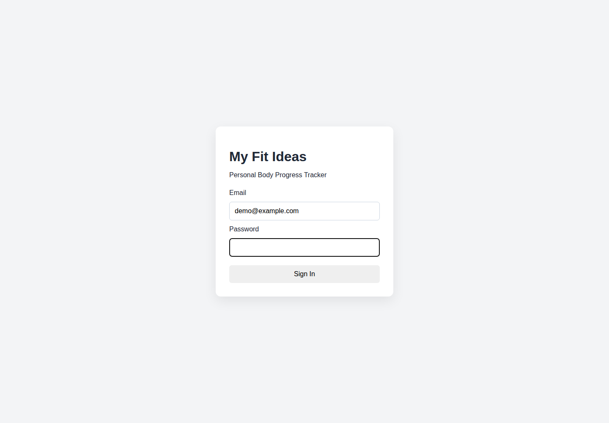
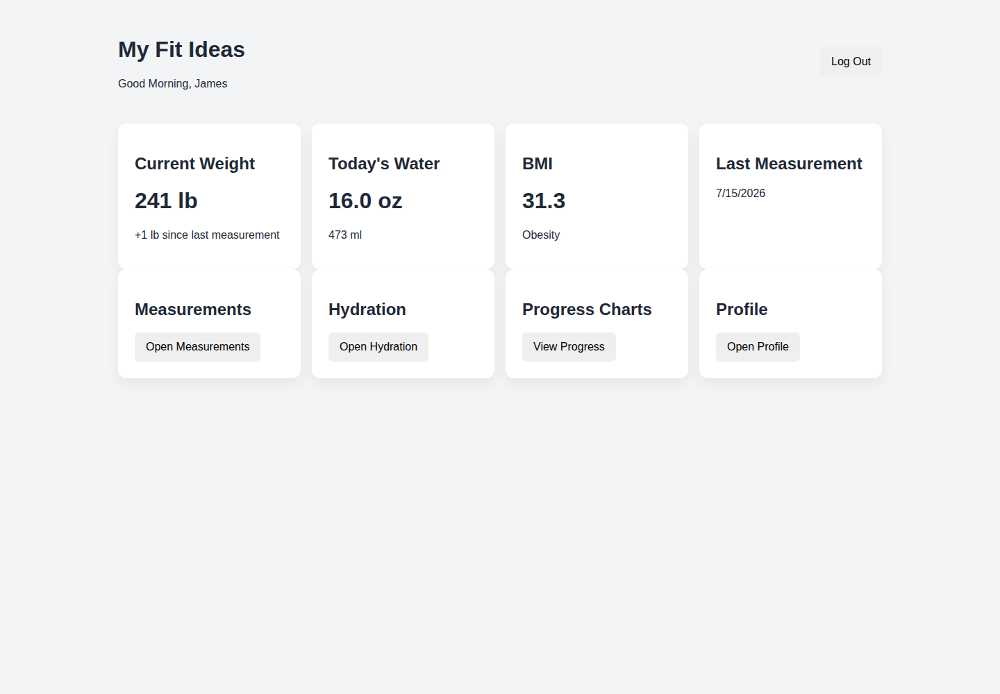
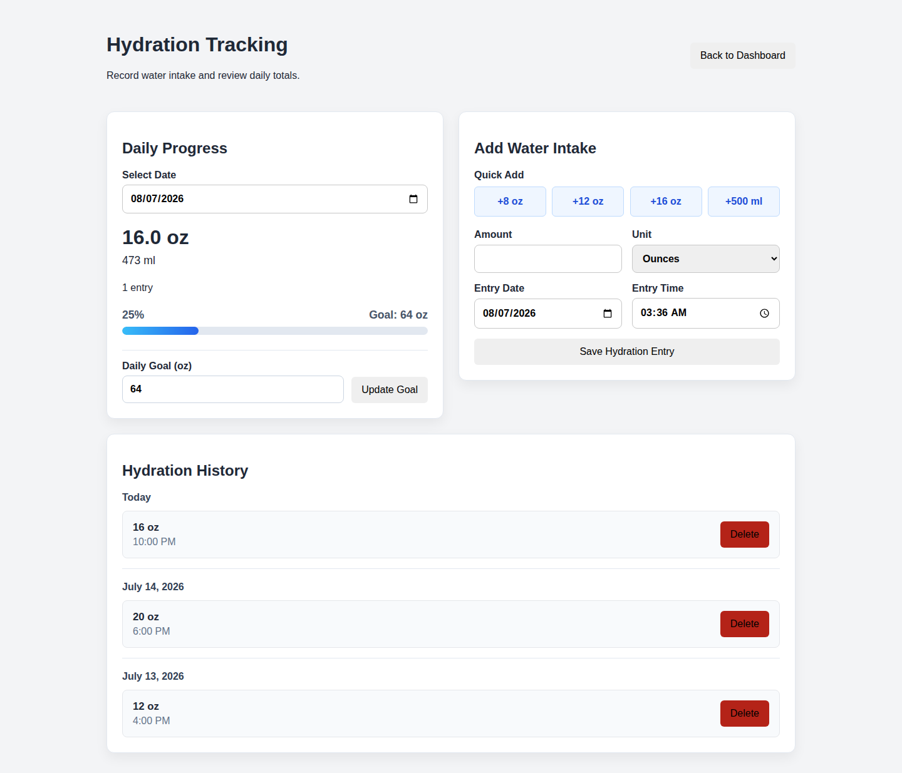
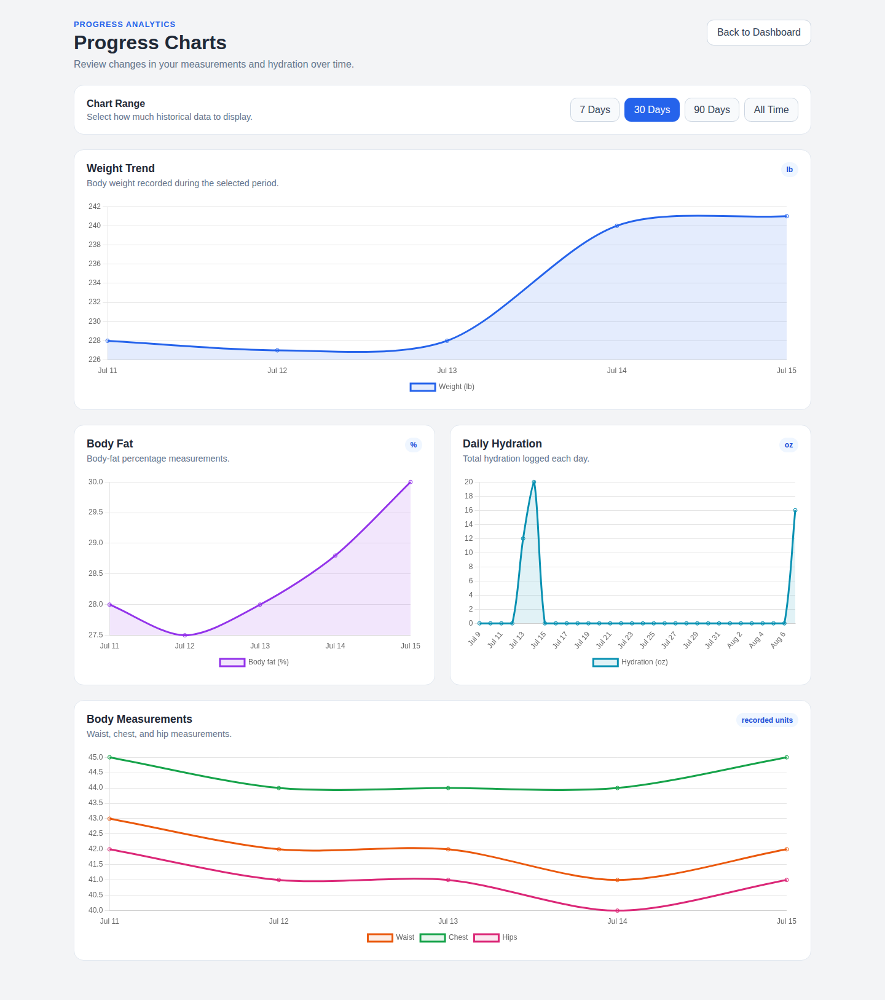

# My Fit Ideas Application Screenshots

These screenshots are captured from the current `main` branch user interface using non-sensitive demonstration data aligned with examples shown in the capstone report. This keeps the portfolio visually consistent with the submitted project while avoiding publication of the complete application source code or private user data.

## Login and Protected Access

The authentication screen provides the entry point to protected application features. Portfolio capture uses a demonstration email address and no password value.

## Dashboard Summary and Navigation

The dashboard combines current weight, daily hydration, BMI, last-measurement information, and direct navigation to the primary modules. Demonstration values mirror the capstone report examples, including a current weight of 241 lb and BMI of 31.3.

## Hydration Tracking

The hydration page demonstrates daily totals, entry controls, progress toward the configured goal, and hydration history.

## Progress Analytics

The progress view converts historical measurement and hydration records into selectable Chart.js visualizations for weight, body fat, body measurements, and daily hydration.

> **Privacy note:** The portfolio captures use demonstration data. Passwords, JWT values, database credentials, private email addresses, and personal health records are not displayed.
